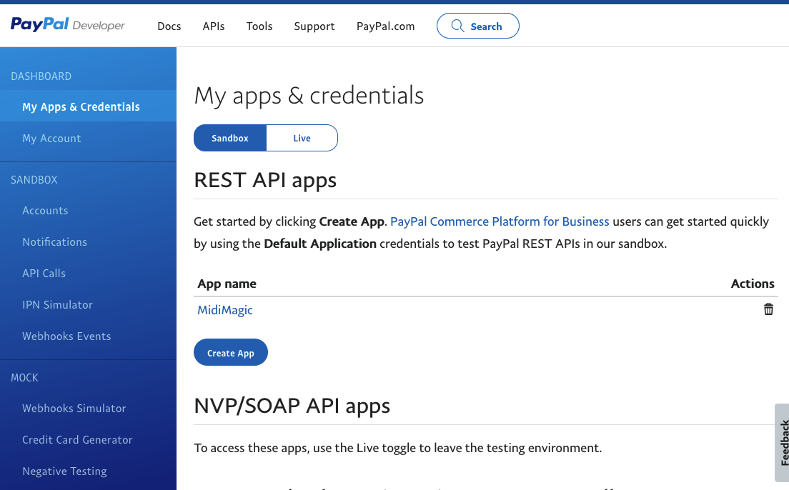

# PayPal integrations

Dependencies:

```
paypalrestsdk==1.13.1
pyyaml==5.4.1
```

## PayPal Subscription

* Ref: [Recurring Payments with Paypal](https://www.youtube.com/watch?v=lwlD9xBDCG0)
* Repo: [Video Store Project](https://github.com/Django-Lessons/video-store-proj)
* [PayPal-Rest-SDK](https://github.com/paypal/PayPal-Python-SDK)

Create an application on https://developer.paypal.com/developer/applications 



From there take CLIENT_ID and Secret values, store them in environment variables and them from `Config` object

```python
# server/config/config.py
class Config(object):
    basedir = os.path.abspath(os.path.dirname(__file__))
    ...
    PAYPAL_CLIENT_ID = os.environment.get('PAYPAL_CLIENT_ID')
    PAYPAL_CLIENT_SECRET = os.environment.get('PAYPAL_CLIENT_SECRET')
```

### Create products and plans

The only way to add products and plans is via rest API.  We can do it via flask commands.

Define your product `lib/paypal/product.yml`

```yaml
---
id: "myproduct-id-demo"
name: "MyProduct Subscription"
description: "Stub Product for Tests"
type: "SERVICE"
```

Define your plan `lib/paypal/plan.yml`

```yaml
---
product_id: myproduct-id-demo
name: "Mensual"
description: "Suscripción mensual"
billing_cycles:
  - frequency:
      interval_unit: "MONTH"
      interval_count: 1
    tenure_type: "REGULAR"
    sequence: 1
    total_cycles: 0
    pricing_scheme:
      fixed_price:
        value: "19.99"
        currency_code: "USD"
payment_preferences:
  auto_bill_outstanding: true
  setup_fee:
    value: 0
    currency_code: "USD"
  setup_fee_failure_action: "CONTINUE"
  payment_failure_threshold: 3
```

Flask commands to generate product and plan

```python
# lib/paypal/paypal_commands.py
import paypalrestsdk
from server.app import app


myapi = paypalrestsdk.Api({
    "mode": mode(),  # noqa
    "client_id": app.config["PAYPAL_CLIENT_ID"],
    "client_secret": app.config["PAYPAL_CLIENT_SECRET"],
})


def create_product():
    with open(PRODUCT_CONF_PATH, "r") as f:
        data = yaml.safe_load(f)
        app.logger.info(data)
        ret = myapi.post("v1/catalogs/products", data)
        app.logger.info(ret)


def create_plan():
    with open(PLAN_CONF_PATH, "r") as f:
        data = yaml.safe_load(f)
        app.logger.info(data)
        ret = myapi.post("v1/billing/plans", data)
        app.logger.info(ret)
```

Add this commands to flask app

```python
# server/app.py
from flask.cli import with_appcontext
import click

def create_app():
    ...
    @app.cli.add_command
    @click.command("create_product")
    @with_appcontext
    def create_product_command():
        """ Create a product defined in paypal/product.yml """
        from .lib.paypal.paypal_commands import create_product
        create_product()

    @app.cli.add_command
    @click.command("create_plan")
    @with_appcontext
    def create_plan_command():
        """ Create a plan with default product, defined in paypal/plan.yml """
        from .lib.paypal.paypal_commands import create_plan
        create_plan()
```

Then you can create your product and plan

    $ flask create_product
    INFO {'id': 'myproduct-id-demo', 'name': 'MyProduct Subscription', 'description': 'Stub Product for Tests', 'type': 'SERVICE'}
    INFO {'id': 'myproduct-id-demo'', 'name': 'MyProduct Subscription', 'description': 'Stub Product for Tests', 'create_time': '2021-09-28T21:24:52Z', 'links': [{'href': 'https://api.sandbox.paypal.com/v1/catalogs/products/myproduct-id-demo', 'rel': 'self', 'method': 'GET'}, {'href': 'https://api.sandbox.paypal.com/v1/catalogs/products/myproduct-id-demo', 'rel': 'edit', 'method': 'PATCH'}]}
    $ flask create_plan
    INFO [server.app.create_plan:53] {'product_id': 'myproduct-id-demo', 'name': 'Mensual', 'description': 'Suscripción mensual', 'billing_cycles': [{'frequency': {'interval_unit': 'MONTH', 'interval_count': 1}, 'tenure_type': 'REGULAR', 'sequence': 1, 'total_cycles': 0, 'pricing_scheme': {'fixed_price': {'value': '19.99', 'currency_code': 'USD'}}}], 'payment_preferences': {'auto_bill_outstanding': True, 'setup_fee': {'value': 0, 'currency_code': 'USD'}, 'setup_fee_failure_action': 'CONTINUE', 'payment_failure_threshold': 3}}
    INFO [server.app.create_plan:55] {'id': 'P-98T556722R998663LMFJYXNY', 'product_id': 'myproduct-id-demo', 'name': 'Mensual', 'status': 'ACTIVE', 'description': 'Suscripción mensual', 'usage_type': 'LICENSED', 'create_time': '2021-09-28T21:40:07Z', 'links': [{'href': 'https://api.sandbox.paypal.com/v1/billing/plans/P-98T556722R998663LMFJYXNY', 'rel': 'self', 'method': 'GET', 'encType': 'application/json'}, {'href': 'https://api.sandbox.paypal.com/v1/billing/plans/P-98T556722R998663LMFJYXNY', 'rel': 'edit', 'method': 'PATCH', 'encType': 'application/json'}, {'href': 'https://api.sandbox.paypal.com/v1/billing/plans/P-98T556722R998663LMFJYXNY/deactivate', 'rel': 'self', 'method': 'POST', 'encType': 'application/json'}]}

Copy the plan id `P-98T556722R998663LMFJYXNY` to `config.py`

```python
class Config(object):
    basedir = os.path.abspath(os.path.dirname(__file__))
    ...
    PAYPAL_CLIENT_ID = os.environment.get('PAYPAL_CLIENT_ID')
    PAYPAL_CLIENT_SECRET = os.environment.get('PAYPAL_CLIENT_SECRET')
    PAYPAL_PLAN_MONTHLY_ID = os.environment.get('PAYPAL_PLAN_MONTHLY_ID')
```

### Prepare PayPal flow

#### Create a subscription id and link it to the user

```python
# lib/paypal/paypal_payments.py

def create_subscription():
    data = {
        'plan_id': app.config["PAYPAL_PLAN_MONTHLY_ID"],
    }
    resp = myapi.post("v1/billing/subscriptions", data)
    app.logger.info(resp)
    return resp


def create_subscription_approve_url(user: User):
    resp = create_subscription()
    if resp["status"] == "APPROVAL_PENDING":
      user.paypal_subscription_id = resp['id']
      # return approve url from resp
      return get_url_from(resp['links'], 'approve')
    else:
      return None

```

```python
# views/paypal_view.py

class PaypalView(Resource):
    @auth_required()
    def get(self):
        # to avoid "cannot import name 'app' from partially initialized module 'server.app'"
        # import function from inside method
        from server.lib.paypal.paypal_payments import create_subscription_approve_url
        redirect_url = create_subscription_approve_url(current_user)
        # users paypal_subscription_id is assigned, commit to db
        db.session.commit()

        if redirect_url:
            return build_data_response(redirect_url, 200)
        else:
            return build_error_response("PAYPAL ERROR", 200)

```

```python
# server/app.py

def create_app():
    ...
    from .views.paypal_view import PaypalView, PaypalWebhookView
    api.add_resource(PaypalView, "/subscription/create")
```

When user requests to subscribe, we create a PayPal subscription id and store it in
user's object.  The subscription is created but is not active yet.  Then we redirect the user to PayPal for user approval with the url rel `approve`


#### Webhooks

```python
# views/paypal_view.py
class PaypalWebhookView(Resource):

    def post(self):
        from server.app import app
        from server.lib.paypal import paypal_payments as paypal

        logger.info(jsonify(request.args))
        print(request.json)
        print("Webhook POST")

        transmission_id = request.headers.get('Paypal-Transmission-Id')
        timestamp = request.headers.get('Paypal-Transmission-Time')
        webhook_id = app.config["PAYPAL_WEBHOOK_ID"]
        event_body = request.data.decode('utf-8')
        cert_url = request.headers.get('Paypal-Cert-Url')
        auth_algo = request.headers.get('Paypal-Auth-Algo')
        actual_signature = request.headers.get('Paypal-Transmission-Sig')
        
        # Validate Webhook data
        response = WebhookEvent.verify(
            transmission_id,
            timestamp,
            webhook_id,
            event_body,
            cert_url,
            actual_signature,
            auth_algo
        )
        if response:
            obj = request.json

            event_type = obj.get('event_type')
            resource = obj.get('resource')

            if event_type == 'PAYMENT.SALE.COMPLETED':
                # update user's pair until value
                paypal.set_paid_until(resource, paypal.SUBSCRIPTION)

            if event_type == 'CHECKOUT.ORDER.APPROVED':
                paypal.set_paid_until(resource, paypal.ORDER)

        return make_response({'success': True}, 200, {'ContentType': 'application/json'})

```

```python
# lib/python/paypal_paymewnts.py

def plus_days(count):
    _date = datetime.now()
    return _date + timedelta(days=count)


def set_paid_until(obj, from_what):

    if from_what == SUBSCRIPTION:
        billing_agreement_id = obj['billing_agreement_id']
        ret = myapi.get(f"v1/billing/subscriptions/{billing_agreement_id}")

        user = User.by_paypal_subscription_id(ret['id'])
        if not user:
            app.logger.error(f"User with order id={ret['id']} not found.")
            return False

        app.logger.debug(f"SUBSCRIPTION {obj} for user {user.email}")
        if obj['amount']['total'] == '19.99':
            user.set_paid_until(plus_days(count=31))
            db.session.commit()

    if from_what == ORDER:
        url = get_url_from(obj['links'], 'self')
        ret = myapi.get(url)

        user = User.by_paypal_subscription_id(ret['id'])
        if not user:
            app.logger.error(f"User with order id={ret['id']} not found.")
            return False

        app.logger.debug(f"ORDER {obj} for user {user.email}")

    return True
```
